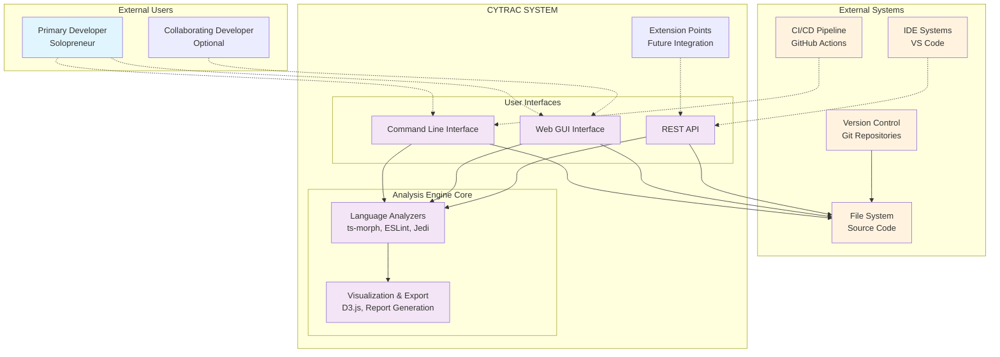
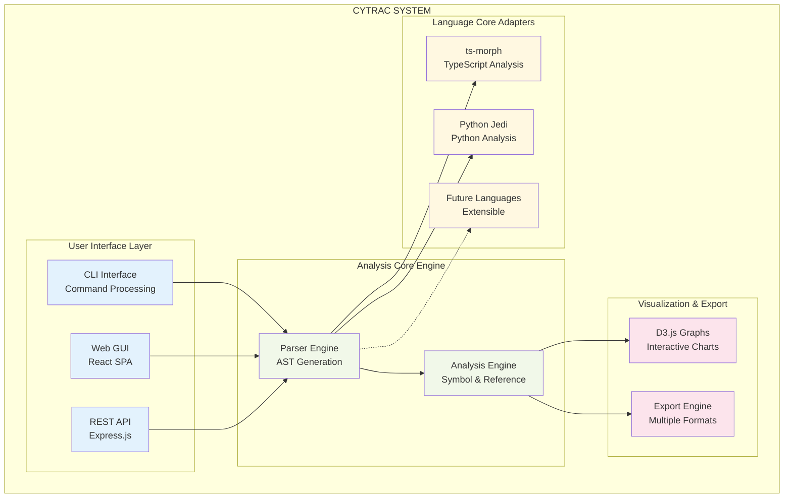
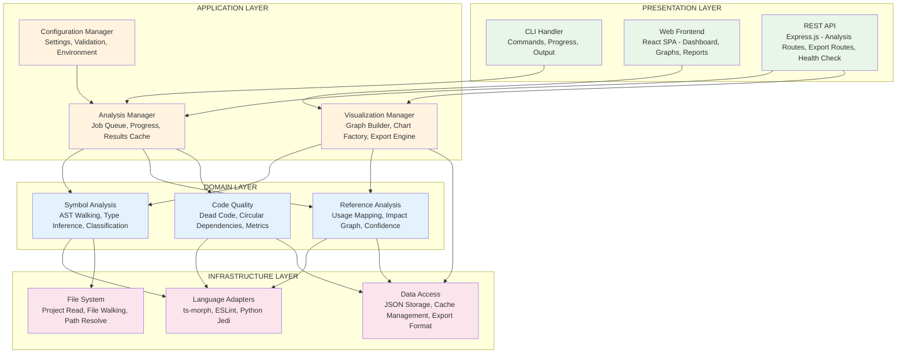
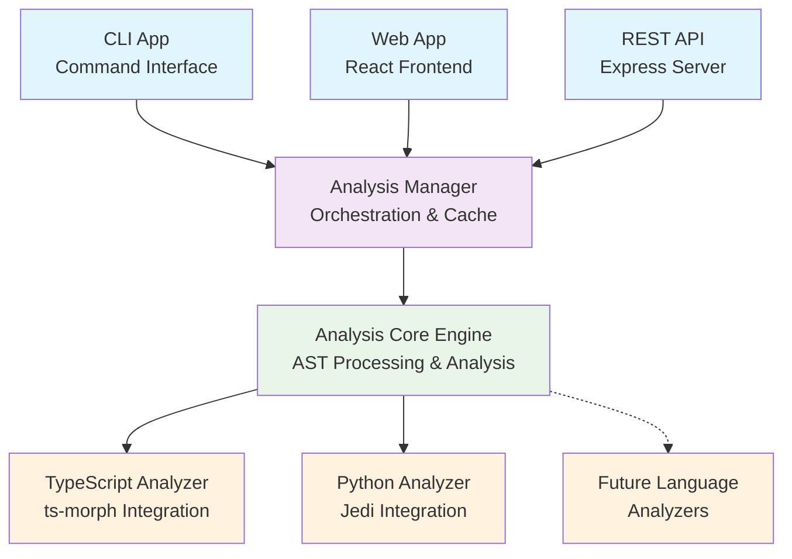
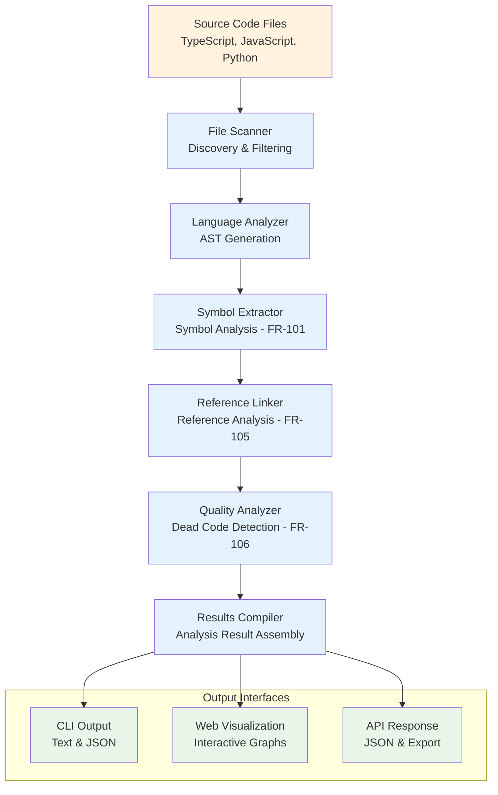

---
# Cytrac Software Architecture Document (SAD)

**Version:** 2.0  
**Date:** January 14, 2025  
**Authors:** CyrusTek Senior Software Architect  
**Reviewed By:** Requirements Engineering Team  
**Status:** Professional Architecture Specification  
**Compliance:** IEEE Std 1016-2009 (Software Design Descriptions)  
**Source Document:** Cytrac Software Requirements Specification (SRS) v3.0  
**GitHub Repository:** https://github.com/louipr/cytrac

---

# Software Architecture Document (SAD)

## 1. Introduction

### 1.1 Purpose
This Software Architecture Document (SAD) describes the comprehensive architectural design of Cytrac, a code analysis and visualization platform optimized for solopreneur developers and small collaborative workflows. This document derives its architectural specifications directly from the authoritative Software Requirements Specification (SRS) v3.0, providing detailed design views and implementation guidelines aligned with streamlined personal development tool requirements.

### 1.2 Scope  
This document covers the complete architectural design for Cytrac's streamlined capabilities as defined in SRS v3.0:
- **Multi-language static analysis** (TypeScript, JavaScript, Node.js, Python) with 100k LOC maximum project support
- **Interactive visualization platform** with local-first web interface optimized for single-user operation
- **Command-line and API interfaces** supporting personal workflow automation and future integration
- **Security-ready modular architecture** supporting current privacy-by-design and future authentication middleware
- **Local-first deployment** with optional simple cloud deployment capability for collaboration scenarios

### 1.3 Definitions and Acronyms
- **AST**: Abstract Syntax Tree - Hierarchical representation of source code structure
- **CLI**: Command Line Interface - Terminal-based user interface
- **GUI**: Graphical User Interface - Web-based interactive interface  
- **REST API**: Representational State Transfer Application Programming Interface
- **SPA**: Single Page Application - React-based frontend architecture
- **LSP**: Language Server Protocol - Standardized language analysis protocol

### 1.4 References
- Cytrac Software Requirements Specification (SRS) v3.0
- IEEE Std 1016-2009: Software Design Descriptions
- IEEE Std 830-1998: Software Requirements Specifications
- TypeScript Language Specification v5.2+
- ESLint Architecture Documentation v9.0+
- React Architecture Patterns v18+

### 1.5 Overview
This document follows IEEE Std 1016-2009 architectural viewpoint structure, providing comprehensive design perspectives derived from SRS v3.0:

1. **Context Viewpoint** - System boundaries, stakeholder relationships, and external interfaces
2. **Composition Viewpoint** - High-level system decomposition and component organization  
3. **Logical Viewpoint** - Functional architecture and key domain abstractions
4. **Dependency Viewpoint** - Component relationships, data flow, and interaction patterns
5. **Information Viewpoint** - Data models, storage architecture, and information management
6. **Patterns Viewpoint** - Architectural patterns, design patterns, and implementation strategies
7. **Interface Viewpoint** - External interfaces, APIs, and integration specifications
8. **Structure Viewpoint** - Physical organization, deployment architecture, and development structure

Each viewpoint directly implements requirements from the authoritative SRS v3.0, ensuring architectural alignment with streamlined solopreneur development workflows.

## 2. System Context and Goals

### 2.1 Architectural Goals
Based on streamlined SRS v3.0 requirements, the architecture prioritizes solopreneur development workflows:

#### 2.1.1 Primary Goals (from SRS NFR requirements)
- **Single-User Optimization**: Simplified architecture optimized for personal development workflows (NFR-202)
- **Local-First Operation**: Privacy-by-design with offline analysis capabilities (NFR-401, SRS 2.4.1)
- **Performance Efficiency**: 30-second analysis for <25k LOC, 5-minute analysis for personal projects up to 100k LOC (NFR-101)
- **Security-Ready Architecture**: Modular design enabling future authentication middleware without current complexity (NFR-401, NFR-402)
- **Extensible Foundation**: Plugin architecture supporting future language analyzers and CyrusTek product evolution (SRS 2.5.1)

#### 2.1.2 Quality Attributes (from SRS Section 3.4)
- **Reliability**: Graceful error handling with local recovery mechanisms (NFR-302, Section 3.4.1)
- **Portability**: Cross-platform operation (Windows 10+, macOS 11+, Ubuntu 20.04+) (Section 3.4.5)
- **Maintainability**: 70%+ test coverage with modular, well-documented architecture (Section 3.4.4)
- **Usability**: 20-minute first-use success for solopreneur developers with minimal documentation (NFR-501)
- **Privacy**: Local-first analysis protecting proprietary source code by design (NFR-401)

### 2.2 Architectural Constraints

#### 2.2.1 Technology Constraints (from SRS 2.5.1)
- **Backend Platform**: Node.js 18.18.0+ LTS with TypeScript 4.9+
- **Frontend Framework**: React 18+ with ES2020+ browser support
- **Analysis Libraries**: ts-morph 27.0+, ESLint 9.0+, Python Jedi 0.19+
- **API Architecture**: RESTful with OpenAPI 3.0+ specification
- **Data Storage**: JSON-based with optional file persistence

#### 2.2.2 Operational Constraints (from SRS 2.5.4)
- **Memory Limits**: <2GB for projects up to 100k LOC (NFR-102, updated from SRS v3.0)
- **Performance Targets**: 5-minute analysis for large personal projects up to 100k LOC (NFR-101)
- **Network Requirements**: Offline-capable analysis, network only for package installation and updates
- **Security Model**: Local-first with privacy-by-design, security-ready for future middleware integration (NFR-401)

### 2.3 Architectural Drivers
Key requirements driving architectural decisions (prioritized by SRS v3.0):

| Driver | Requirement Source | Architectural Impact |
|--------|-------------------|---------------------|
| Single-user optimization | NFR-202 (SRS primary focus) | Simplified concurrency, local storage, no authentication layer |
| Local-first privacy | NFR-401, SRS 2.4.1 | File system analysis, no cloud dependencies, offline operation |
| Performance targets | NFR-101, NFR-102 | Efficient AST processing, streaming analysis, memory management |
| Multi-language support | FR-101-106 | Pluggable analyzer architecture with unified interfaces |
| Security-ready design | NFR-401, NFR-402 | Middleware-ready API design for future authentication |
| Developer workflow integration | FR-302, FR-303 | CLI-first design, IDE plugins, CI/CD automation hooks |
| Future extensibility | SRS 2.5.1, CyrusTek vision | Modular plugin architecture, configuration management |

## 3. Architectural Views

### 3.1 Context Viewpoint

The Context Viewpoint defines system boundaries, external entities, and stakeholder relationships as specified in SRS v3.0.

#### 3.1.1 System Context Diagram



#### 3.1.2 External Entities

**Primary Stakeholders (from SRS 2.3)**
- **Solopreneur Developer**: Primary user performing daily analysis on personal projects up to 100k LOC
- **Collaborating Developer**: Secondary user for occasional code review and pair programming sessions

**External Systems**
- **Local File System**: Source code repositories (local development directories, mounted drives)
- **Version Control Systems**: Git repositories for change tracking and incremental analysis
- **CI/CD Integration**: GitHub Actions for automated analysis in personal project workflows
- **IDE Environments**: Visual Studio Code integration for real-time analysis feedback
- **Package Managers**: npm, pip for dependency analysis and installation management

### 3.2 Composition Viewpoint

The Composition Viewpoint describes the system's high-level decomposition into major architectural components, aligned with SRS v3.0 functional requirements.

#### 3.2.1 High-Level System Decomposition



#### 3.2.2 Component Responsibilities

| Component | Primary Responsibilities | SRS Requirements |
|-----------|-------------------------|------------------|
| **User Interface Layer** | CLI, GUI, API request handling | FR-201, FR-202, FR-301 |
| **Analysis Core Engine** | AST processing, symbol analysis, dead code detection | FR-101-106 |
| **Visualization & Export** | Interactive graphs, report generation | FR-203, FR-401 |
| **Language Core Adapters** | Language-specific AST parsing and analysis | FR-101, FR-104 technical constraints |

### 3.3 Logical Viewpoint

The Logical Viewpoint presents the functional architecture and key domain abstractions that implement SRS v3.0 analysis requirements.

#### 3.3.1 Functional Architecture



#### 3.3.2 Key Abstractions

**Analysis Pipeline (Core Domain Model)**
```typescript
interface AnalysisResult {
  projectInfo: ProjectMetadata;
  symbols: SymbolInventory;           // ~10k-50k symbols for 100k LOC
  dependencies: DependencyGraph;      // Module-level dependency mapping
  callGraph: CallHierarchy;          // Function-level call relationships  
  references: ReferenceMap;          // Symbol usage analysis
  deadCode: DeadCodeFindings;        // Unused code detection results
  metrics: QualityMetrics;           // Code quality measurements
  performance: AnalysisMetrics;      // Analysis execution metrics
}

interface AnalysisEngine {
  analyze(projectPath: string, options: AnalysisOptions): Promise<AnalysisResult>;
  getProgress(): AnalysisProgress;   // Real-time progress for NFR-101
  cancel(): void;                    // Cancellation support
  validateMemoryLimits(): boolean;   // NFR-102 memory constraint checking
}

// Performance-optimized processing configuration
interface AnalysisOptions {
  memoryLimit: number;              // Default: 2GB (NFR-102)
  batchSize: number;                // Default: 1000 files per batch
  enableCache: boolean;             // Default: true for local development
  progressCallback?: (progress: AnalysisProgress) => void;
  languageFilters?: LanguageType[]; // Selective analysis for performance
  confidenceThreshold: number;     // Dead code detection threshold (0.0-1.0)
}
```

**Security-Ready Architecture (Future Extension Points)**
```typescript
interface SecurityContext {
  sessionId: string;                // Local session tracking
  auditLog: AuditEntry[];          // Action logging for development workflow
  config: SecurityConfiguration;    // Future: authentication, authorization settings
}

interface ConfigurationService {
  get<T>(key: string): T;
  set(key: string, value: any): void;
  
  // Current: local development settings
  project: ProjectConfiguration;
  analysis: AnalysisConfiguration;
  
  // Security extension point (disabled by default)
  security?: SecurityConfiguration; // Optional, for future collaboration features
}

// Local-first configuration management
interface ProjectConfiguration {
  includePatterns: string[];        // File inclusion patterns
  excludePatterns: string[];        // Standard exclusions (.git, node_modules, .venv)
  languageSettings: LanguageConfig; // Language-specific analysis settings
  memoryLimit: number;              // Project-specific memory limits
  cacheEnabled: boolean;            // Local caching preferences
}
```

### 3.4 Dependency Viewpoint

The Dependency Viewpoint illustrates component relationships and data flow patterns supporting SRS v3.0 analysis workflows.

#### 3.4.1 Component Dependency Graph



#### 3.4.2 Data Flow Architecture



### 3.5 Information Viewpoint

The Information Viewpoint defines data models, storage architecture, and information management strategies aligned with SRS v3.0 local-first requirements.

#### 3.5.1 Data Model

**Core Analysis Data Structures**

```typescript
// Project Metadata (SRS 4.6.3)
interface ProjectMetadata {
  path: string;
  name: string;
  languages: string[];
  fileCount: number;
  totalLOC: number;
  analysisTimestamp: Date;
  version: string;
  executionTime: number;
}

// Symbol Information (FR-101)
interface Symbol {
  id: string;
  name: string;
  type: SymbolType; // function, class, variable, interface, type, module
  location: SourceLocation;
  visibility: Visibility; // public, private, protected, internal
  confidence: number; // 0.0-1.0 for dynamic analysis uncertainty
  metadata: SymbolMetadata;
}

// Dependency Relationships (FR-102)
interface DependencyEdge {
  from: string; // source module
  to: string;   // target module
  type: DependencyType; // import, require, dynamic
  location: SourceLocation;
  isCircular: boolean;
}

// Call Graph Data (FR-103)
interface CallEdge {
  caller: string;
  callee: string;
  callType: CallType; // direct, callback, async
  location: SourceLocation;
  confidence: number;
}

// Dead Code Findings (FR-106)
interface DeadCodeItem {
  symbol: string;
  type: DeadCodeType; // unused_variable, unused_function, unreachable_code
  location: SourceLocation;
  confidence: number; // 0.0-1.0
  safeToRemove: boolean;
  reason: string;
}
```

#### 3.5.2 Storage Architecture

**Local-First Storage Strategy (SRS 2.6.2 - local development focus)**

```
Project Root/
├── .cytrac/                    # Analysis cache and config
│   ├── config.json            # Project-specific settings
│   ├── cache/                 # Analysis result caching
│   │   ├── symbols.json       # Symbol analysis cache
│   │   ├── dependencies.json  # Dependency graph cache
│   │   └── metadata.json      # Project metadata cache
│   └── exports/               # Generated reports
│       ├── analysis-report.pdf
│       ├── dependency-graph.svg
│       └── dead-code-report.csv
```

**Configuration Hierarchy (FR-402)**
```
System Level:    ~/.cytrac/config.json
Project Level:   ./cytrac-config.json  
Runtime Level:   Environment variables + CLI flags
```

### 3.6 Patterns Viewpoint

The Patterns Viewpoint describes architectural patterns and design strategies that support SRS v3.0 requirements for modularity, extensibility, and security-ready design.

#### 3.6.1 Architectural Patterns

**1. Layered Architecture Pattern**
- **Purpose**: Clear separation of concerns with defined interfaces
- **Implementation**: Presentation → Application → Domain → Infrastructure
- **Benefits**: Maintainability, testability, extensibility
- **SRS Alignment**: Supports modular architecture requirement (SRS 2.5.1)

**2. Plugin Architecture Pattern**
```typescript
interface LanguageAnalyzer {
  readonly name: string;
  readonly supportedExtensions: string[];
  
  parseFile(filePath: string): Promise<AST>;
  extractSymbols(ast: AST): Promise<Symbol[]>;
  findReferences(ast: AST, symbol: Symbol): Promise<Reference[]>;
  detectDeadCode(symbols: Symbol[], references: Reference[]): Promise<DeadCodeItem[]>;
}

// Current implementations
class TypeScriptAnalyzer implements LanguageAnalyzer { /* ts-morph based */ }
class PythonAnalyzer implements LanguageAnalyzer { /* Jedi based */ }

// Future extensibility
class JavaAnalyzer implements LanguageAnalyzer { /* Future addition */ }
```

**3. Security-Ready Middleware Pattern (NFR-401, NFR-402)**
```typescript
interface RequestContext {
  sessionId: string;       // Current analysis session
  audit: AuditInfo;        // Request logging and tracking
  config: UserConfig;      // Personal configuration settings
  // Future extension points for security middleware
  security?: SecurityContext; // Optional, for future authentication
}

interface ApiMiddleware {
  handle(req: Request, res: Response, next: NextFunction): Promise<void>;
}

// Current: no-op authentication for local personal use
class LocalOnlyMiddleware implements ApiMiddleware {
  async handle(req, res, next) { 
    // Simple session tracking for local development
    req.context = { sessionId: generateSessionId(), audit: basicAudit() };
    next(); 
  }
}

// Future extension: Security middleware integration point
class SecurityMiddleware implements ApiMiddleware {
  async handle(req, res, next) {
    // Future: Authentication and authorization logic
    // Supports SRS v3.0 security-ready architecture
  }
}
```

**4. Observer Pattern for Progress Reporting**
```typescript
interface AnalysisObserver {
  onProgress(stage: string, percentage: number): void;
  onStageComplete(stage: string, result: any): void;
  onError(error: Error): void;
}

// Supports NFR-101 progress indicators requirement
```

#### 3.6.2 Design Patterns

**Factory Pattern for Language Analyzers**
- **Purpose**: Abstract analyzer creation and selection
- **Benefits**: Easy addition of new language support
- **Implementation**: Based on file extensions and configuration

**Strategy Pattern for Export Formats**  
- **Purpose**: Support multiple export formats (JSON, CSV, PDF, HTML)
- **Benefits**: Easy addition of new export formats
- **SRS Alignment**: FR-401 multiple export format requirement

**Command Pattern for CLI Operations**
- **Purpose**: Encapsulate analysis operations as objects
- **Benefits**: Undo/redo capability, operation queuing
- **SRS Alignment**: FR-201 comprehensive CLI requirement

### 3.7 Interface Viewpoint

The Interface Viewpoint specifies external interfaces, APIs, and integration patterns that implement SRS v3.0 user interface and integration requirements.

#### 3.7.1 User Interfaces

**Command Line Interface (FR-201)**
```bash
# Primary Commands (SRS 4.6.3 examples)
cytrac analyze <project-path> [options]
cytrac export <analysis-id> --format <json|csv|pdf|html>
cytrac config set <key> <value>
cytrac version

# Options
--format <json|text|report>    # Output format
--output <file>                # Output file path  
--languages <ts,js,py>         # Language filter
--memory-limit <2GB>           # Memory constraint (NFR-102)
--config <config-file>         # Configuration file
--verbose                      # Progress indicators (NFR-101)
--exclude <pattern>            # File exclusion patterns
--confidence-threshold <0.8>   # Dead code detection threshold
```

**Web Interface (FR-202, FR-203)**
```
GET  /                         # Dashboard home
GET  /analyze                  # Analysis initiation page  
POST /api/analyze              # Start analysis
GET  /api/analyze/:id          # Get analysis results
GET  /results/:id              # Results visualization page
GET  /export/:id/:format       # Export analysis results
```

**REST API (FR-301)**
```
POST /api/v1/analysis
  Body: { projectPath, options }
  Response: { analysisId, status }

GET /api/v1/analysis/:id
  Response: AnalysisResult | { status, progress }

GET /api/v1/analysis/:id/export/:format
  Response: Exported data in requested format

GET /api/v1/health  
  Response: { status, version, uptime }

POST /api/v1/config
  Body: ConfigurationUpdate
  Response: { success, config }
```

#### 3.7.2 Integration Interfaces

**IDE Integration (FR-302)**
```typescript
interface IDEIntegration {
  // Language Server Protocol compatibility
  initialize(params: InitializeParams): Promise<InitializeResult>;
  textDocument_didOpen(params: DidOpenTextDocumentParams): void;
  textDocument_didChange(params: DidChangeTextDocumentParams): void;
  textDocument_analysis(params: AnalysisParams): Promise<AnalysisResult>;
}
```

**CI/CD Integration (FR-303)**
```yaml
# GitHub Actions Example
- name: Run Cytrac Analysis
  uses: cytrac-action@v1
  with:
    project-path: './src'
    format: 'json'
    quality-gate: true
    confidence-threshold: 0.8
```

### 3.8 Structure Viewpoint

The Structure Viewpoint defines physical organization and deployment architecture supporting SRS v3.0 local-first development and optional collaboration scenarios.

#### 3.8.1 Physical Architecture

**Development Structure**
```
cytrac/
├── packages/
│   ├── core/                  # Analysis engine
│   │   ├── src/
│   │   │   ├── analyzers/     # Language-specific analyzers
│   │   │   ├── engine/        # Core analysis logic
│   │   │   └── types/         # TypeScript definitions
│   │   └── package.json
│   │
│   ├── cli/                   # Command line interface
│   │   ├── src/
│   │   │   ├── commands/      # CLI command implementations
│   │   │   └── utils/         # CLI utilities
│   │   └── package.json
│   │
│   ├── web/                   # Web frontend (React)
│   │   ├── src/
│   │   │   ├── components/    # React components
│   │   │   ├── pages/         # Page components
│   │   │   ├── services/      # API clients
│   │   │   └── types/         # Frontend types
│   │   └── package.json
│   │
│   └── api/                   # REST API server
│       ├── src/
│       │   ├── routes/        # Express routes
│       │   ├── middleware/    # Request middleware
│       │   └── services/      # Business logic
│       └── package.json
│
├── tools/                     # Build and development tools
├── docs/                      # Documentation
└── tests/                     # Integration tests
```

#### 3.8.2 Deployment Architecture

**Local Development Deployment (Primary - NFR-202)**
```
Developer Machine
├── Node.js Runtime (18.18.0+)
├── Cytrac CLI (Global Install)
├── Analysis Results Cache (~/.cytrac/)
└── Project-Specific Config (./cytrac-config.json)
```

**Optional Cloud Deployment (SRS 2.4.2)**
```
Container (Docker)
├── Node.js Application
├── Web Frontend (Static Files)  
├── REST API Server
└── File System Mount (Analysis Target)

Accessible via:
├── HTTPS Endpoint (Web UI)
├── API Endpoints (REST)
└── CLI (Remote Mode)
```

## 4. Design Rationale

### 4.1 Architectural Decisions

#### 4.1.1 Monorepo with Modular Packages
**Decision**: Use monorepo structure with separate packages for core, CLI, web, and API components
**Rationale**: 
- Supports SRS v3.0 modular architecture requirement (2.5.1) for maintainable personal development
- Enables selective deployment patterns (CLI-only for automation, web interface for visualization)
- Facilitates independent testing and development of analysis vs. visualization components
- Maintains clear separation of concerns supporting 70%+ test coverage requirement (SRS 3.4.4)
- Enables future extensibility when personal projects grow into collaboration scenarios

#### 4.1.2 Local-First with Optional Simple Cloud Deployment  
**Decision**: Primary deployment as local desktop tool with optional cloud deployment for collaboration
**Rationale**:
- Aligns with SRS v3.0 solopreneur user class and single-user operation (NFR-202)
- Supports privacy-by-design requirement with local file system analysis (NFR-401) 
- Enables offline analysis capability essential for personal development workflows (SRS 2.4.1)
- Reduces operational complexity and infrastructure costs for individual developers
- Maintains optional cloud deployment for collaboration scenarios without requiring it

#### 4.1.3 Security-Ready Architecture without Current Implementation
**Decision**: Design API middleware integration points without current authentication implementation
**Rationale**:
- Supports SRS v3.0 security-ready architecture requirement (NFR-401, NFR-402)
- Avoids unnecessary complexity for current solopreneur use case (SRS 2.3.1)
- Enables incremental security feature addition when collaboration needs arise
- Maintains architectural extensibility for optional future security features

#### 4.1.4 Plugin-Based Language Support
**Decision**: Abstract language analyzers behind unified interface with extension points
**Rationale**:
- Supports SRS v3.0 extensibility requirement (Section 3.4.6)
- Enables future language additions without core architecture changes
- Facilitates independent testing and maintenance of language-specific analysis logic
- Aligns with open/closed principle supporting personal project evolution

### 4.2 Technology Selection Rationale

#### 4.2.1 Core Technology Stack
| Technology | Version Requirement | Rationale | SRS Alignment |
|------------|-------------------|-----------|---------------|
| **Node.js** | 18.18.0+ LTS | ESLint 9.0+ compatibility requirement, mature ecosystem, 208k+ ts-morph users | SRS 2.5.1 technology constraints |
| **TypeScript** | 4.9+ (5.2+ preferred) | Type safety, ts-morph AST compatibility, modern language features | SRS 2.5.1 AST analysis requirements |
| **ts-morph** | 27.0+ | Mature TypeScript AST manipulation, 208k+ weekly downloads, comprehensive API | SRS technical research validation |
| **ESLint** | 9.0+ | Static analysis engine, extensible rule system, Node.js 18.18.0+ requirement | SRS 2.5.1 JavaScript analysis |
| **Python Jedi** | 0.19+ | Python static analysis, Python 3.8+ support, mature autocomplete engine | SRS Python analysis capability |
| **React** | 18+ | Modern frontend framework, component architecture, ES2020+ browser support | SRS 2.5.1 interactive visualization |
| **Express.js** | 4.18+ | Lightweight REST framework, middleware pattern, security middleware ready | SRS security-ready architecture |
| **D3.js** | 7.0+ | Interactive data visualization, SVG manipulation, graph algorithms | SRS FR-203 visualization requirements |

#### 4.2.2 Design Pattern Selection
- **Layered Architecture**: Clean separation supporting 70%+ test coverage (SRS 3.4.4)
- **Plugin Pattern**: Future language extensibility (SRS 3.4.6)  
- **Observer Pattern**: Progress reporting for long analyses (NFR-101)
- **Strategy Pattern**: Multiple export formats (FR-401)

### 4.3 Performance Design Decisions

#### 4.3.1 Memory Management Strategy
**Decision**: Streaming AST processing with configurable memory limits and progressive analysis
**Technical Implementation**:
- **Memory Target**: <2GB total consumption for projects up to 100k LOC (NFR-102)
- **Streaming Processing**: Process files in 1000-file batches to maintain memory efficiency
- **AST Caching**: LRU cache for 500 most recently analyzed files with automatic eviction
- **Garbage Collection**: Explicit memory management with V8 heap monitoring
**Rationale**:
- Supports SRS v3.0 updated memory targets for personal project scale (100k LOC maximum)
- Enables graceful degradation on resource-constrained development machines
- Optimized for single-user desktop workflow patterns vs. concurrent server processing

#### 4.3.2 Analysis Performance Strategy  
**Decision**: Multi-stage progressive analysis with early result feedback and incremental processing
**Technical Implementation**:
- **Stage 1**: File discovery and basic parsing (target: 5-10 seconds for 100k LOC)
- **Stage 2**: Symbol extraction and basic analysis (target: 30-60 seconds for 100k LOC)  
- **Stage 3**: Reference analysis and quality checks (target: 2-5 minutes total for 100k LOC)
- **Incremental Updates**: File-level change detection with selective re-analysis
- **Progress Reporting**: Real-time progress indicators every 100ms during analysis (NFR-101)
**Rationale**:
- Achieves SRS v3.0 performance targets: 30s for <25k LOC, 5min for large personal projects
- Provides immediate feedback for developer workflow integration
- Supports iterative development patterns common in personal projects

#### 4.3.3 Local Caching Strategy  
**Decision**: Project-level analysis result caching with file-system based persistence and incremental updates
**Technical Implementation**:
- **Cache Location**: `~/.cytrac/cache/<project-hash>/` with JSON-based storage
- **Cache Strategy**: Separate caches for symbols, dependencies, references, and quality metrics
- **Invalidation**: File modification time + content hash based cache invalidation
- **Size Management**: Automatic cleanup of caches older than 30 days, 1GB total cache limit
- **Performance Impact**: 90%+ cache hit rate for unchanged files, <1s cache retrieval
**Rationale**:
- Enables sub-second re-analysis for unchanged code sections during development cycles
- Supports offline development workflow essential for personal development (SRS 2.4.1)
- Balances cache effectiveness with disk space constraints on personal development machines

## 5. Conclusion

### 5.1 Architecture Summary
This architecture provides a solid foundation for Cytrac as a professional personal development tool, implementing all requirements from SRS v3.0 with security-ready design for optional future collaboration capabilities. The modular, local-first architecture optimizes current solopreneur workflows while maintaining extensibility for evolving personal project needs.

### 5.2 Implementation Priorities
1. **Core Analysis Engine**: Foundation implementing FR-101-106 for multi-language analysis
2. **CLI Interface**: Primary interface for solopreneur developer workflows (FR-201)
3. **Web Interface**: Interactive visualization and comprehensive reporting (FR-202, FR-203)
4. **API Layer**: Integration capabilities and workflow automation support (FR-301)
5. **Security Integration Points**: Middleware architecture ready for future collaboration features

### 5.3 Future Evolution Path
The architecture supports natural evolution paths for personal project growth:
- **Collaboration Support**: Optional authentication and session management for pair programming
- **Advanced Analysis**: Additional language analyzer plugins (Java, C#, Go, Rust)
- **Enhanced Visualization**: Advanced graph algorithms and reporting capabilities
- **Integration Expansion**: Additional IDE plugins and CI/CD platform support
- **Cloud Deployment**: Simple cloud hosting for team collaboration when needed

This architecture achieves the balance between current personal development optimization and future extensibility, positioning Cytrac as an effective tool that grows with developer needs while maintaining the privacy-by-design and local-first principles essential for personal development workflows.
