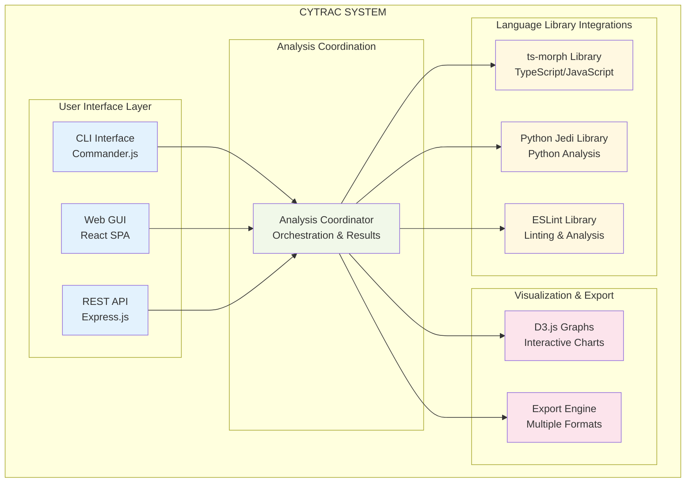
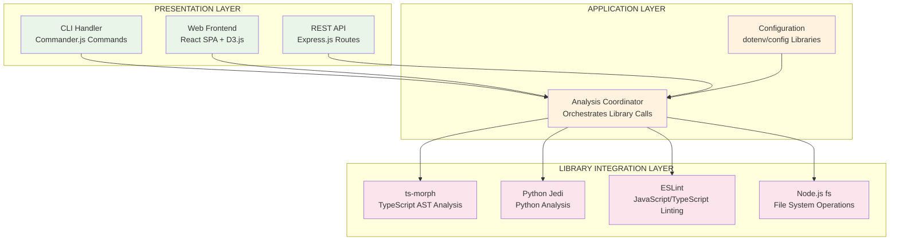
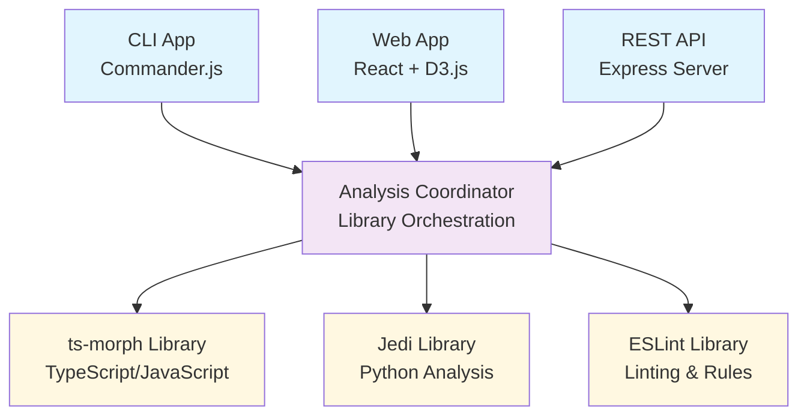
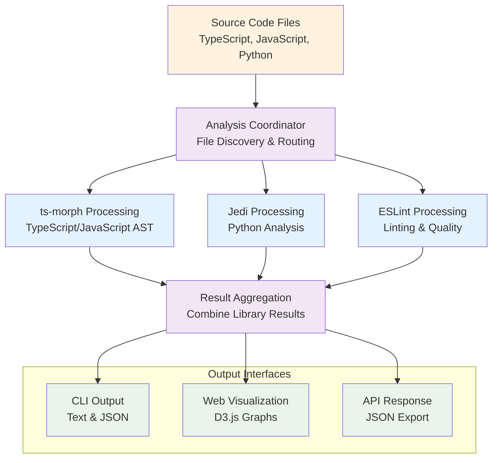

# Cytrac Software Architecture Document (SAD)

## 1. Introduction

### 1.1 Purpose
This Software Architecture Document (SAD) describes the comprehensive architectural design of Cytrac, a code analysis and visualization platform optimized for solopreneur developers and small collaborative workflows. This document provides architectural views, design rationale, and implementation guidelines while maintaining focus on architectural concerns.

### 1.2 Scope  
This document covers the complete architectural design for Cytrac's capabilities:
- **Multi-language static analysis** (TypeScript, JavaScript, Node.js, Python) supporting projects up to 100k lines of code
- **Interactive visualization platform** with local-first web interface optimized for single-user operation
- **Command-line and API interfaces** supporting personal workflow automation and integration
- **Security-ready modular architecture** supporting privacy-by-design with optional authentication middleware
- **Local-first deployment** with optional cloud deployment capability for collaboration scenarios

### 1.3 Definitions and Acronyms
- **AST**: Abstract Syntax Tree - Hierarchical representation of source code structure
- **CLI**: Command Line Interface - Terminal-based user interface
- **GUI**: Graphical User Interface - Web-based interactive interface  
- **REST API**: Representational State Transfer Application Programming Interface
- **SPA**: Single Page Application - React-based frontend architecture
- **LSP**: Language Server Protocol - Standardized language analysis protocol

### 1.4 References
- Cytrac Software Requirements Specification (SRS) v3.0
- IEEE Std 1016-2009: Software Design Descriptions
- IEEE Std 830-1998: Software Requirements Specifications
- TypeScript Language Specification v5.2+
- ESLint Architecture Documentation v9.0+
- React Architecture Patterns v18+

### 1.5 Overview
This document follows IEEE Std 1016-2009 architectural viewpoint structure, providing comprehensive design perspectives:

1. **Context Viewpoint** - System boundaries, stakeholder relationships, and external interfaces
2. **Composition Viewpoint** - High-level system decomposition and component organization  
3. **Logical Viewpoint** - Functional architecture and key domain abstractions
4. **Dependency Viewpoint** - Component relationships, data flow, and interaction patterns
5. **Information Viewpoint** - Data models, storage architecture, and information management
6. **Patterns Viewpoint** - Architectural patterns, design patterns, and implementation strategies
7. **Interface Viewpoint** - External interfaces, APIs, and integration specifications
8. **Structure Viewpoint** - Physical organization, deployment architecture, and development structure

Each viewpoint addresses specific architectural concerns while maintaining traceability to the system requirements.

## 2. System Context and Goals

### 2.1 Architectural Goals
The architecture prioritizes solopreneur development workflows with the following design objectives:

#### 2.1.1 Primary Architectural Objectives
- **Single-User Optimization**: Simplified architecture optimized for personal development workflows
- **Local-First Operation**: Privacy-by-design with offline analysis capabilities
- **Performance Efficiency**: Sub-minute analysis for typical personal projects, 5-minute maximum for large projects
- **Security-Ready Architecture**: Modular design enabling future authentication middleware without current complexity
- **Extensible Foundation**: Composition-based architecture supporting future language library integrations and collaboration features

#### 2.1.2 Quality Attribute Requirements
- **Reliability**: Graceful error handling with local recovery mechanisms
- **Portability**: Cross-platform operation (Windows 10+, macOS 11+, Ubuntu 20.04+)
- **Maintainability**: High test coverage with modular, well-documented architecture
- **Usability**: Minimal learning curve for experienced developers with comprehensive tooling
- **Privacy**: Local-first analysis protecting proprietary source code by design

### 2.2 Architectural Constraints

#### 2.2.1 Technology Constraints
- **Backend Platform**: Node.js 18.18.0+ LTS with TypeScript 4.9+
- **Frontend Framework**: React 18+ with ES2020+ browser support
- **Analysis Libraries**: ts-morph 27.0+, ESLint 9.0+, Python Jedi 0.19+
- **API Architecture**: RESTful with OpenAPI 3.0+ specification
- **Data Storage**: JSON-based with optional file persistence

#### 2.2.2 Operational Constraints
- **Memory Limits**: <2GB for projects up to 100k lines of code
- **Performance Targets**: Sub-minute analysis for typical projects, 5-minute maximum for large projects
- **Network Requirements**: Offline-capable analysis, network only for package installation and updates
- **Security Model**: Local-first with privacy-by-design, security-ready for future middleware integration

### 2.3 Architectural Drivers
Key requirements driving architectural decisions:

| Driver | Architectural Impact |
|--------|---------------------|
| Single-user optimization | Simplified concurrency, local storage, no authentication layer |
| Local-first privacy | File system analysis, no cloud dependencies, offline operation |
| Performance targets | Delegates to library optimizations (ts-morph, ESLint, Jedi) |
| Multi-language support | Direct library integration with minimal wrapper layers |
| Security-ready design | Standard Express middleware patterns for future authentication |
| Developer workflow integration | CLI (Commander.js), IDE plugins, CI/CD automation hooks |
| Future extensibility | Library ecosystem extensibility, standard configuration patterns |

## 3. Architectural Views

This section presents the system architecture through multiple complementary viewpoints, following IEEE 1016-2009 guidelines for comprehensive architectural documentation.

### 3.1 Context Viewpoint

The Context Viewpoint defines system boundaries, external entities, and stakeholder relationships.

#### 3.1.1 System Context Diagram


#### 3.1.2 External Entities

**Primary Stakeholders**
- **Solopreneur Developer**: Primary user performing daily analysis on personal projects up to 100k lines of code
- **Collaborating Developer**: Secondary user for occasional code review and pair programming sessions

**External Systems**
- **Local File System**: Source code repositories (local development directories, mounted drives)
- **Version Control Systems**: Git repositories for change tracking and incremental analysis
- **CI/CD Integration**: GitHub Actions for automated analysis in personal project workflows
- **IDE Environments**: Visual Studio Code integration for real-time analysis feedback
- **Package Managers**: npm, pip for dependency analysis and installation management

### 3.2 Composition Viewpoint

The Composition Viewpoint describes the system's high-level decomposition into major architectural components.

#### 3.2.1 High-Level System Decomposition



#### 3.2.2 Component Responsibilities

| Component | Primary Responsibilities |
|-----------|-------------------------|
| **User Interface Layer** | CLI (Commander.js), Web GUI (React), API (Express.js) request handling |
| **Analysis Coordination** | Orchestrates library calls, aggregates results, manages configuration |
| **Visualization & Export** | D3.js interactive graphs, report generation, multiple export formats |
| **Library Integrations** | ts-morph (TypeScript/JavaScript), Jedi (Python), ESLint (linting) |

### 3.3 Logical Viewpoint

The Logical Viewpoint presents the functional architecture and key domain abstractions that implement the system's analysis capabilities.

#### 3.3.1 Functional Architecture



#### 3.3.2 Key Abstractions

**Analysis Pipeline (Core Domain Model)**

```typescript
// High-level analysis coordination interface
interface CytracAnalysisCoordinator {
  analyze(projectPath: string, options: AnalysisOptions): Promise<AnalysisResult>;
  onProgress?: (progress: { stage: string; percentage: number }) => void;
}

// Configuration options with library delegation
interface AnalysisOptions {
  languages?: string[];
  memoryLimit?: number;
  outputPath?: string;
}
```

**Security-Ready Architecture (Future Extension Points)**
```typescript
// Extension points for future authentication
interface SecurityContext {
  sessionId: string;
  user?: Express.User;        // Standard Express patterns
  permissions?: string[];
}

// Configuration management approach
interface ConfigurationService {
  get<T>(key: string): T;
  loadFromEnvironment(): void;
  loadFromFile(path: string): void;
}
```

### 3.4 Dependency Viewpoint

The Dependency Viewpoint illustrates component relationships and data flow patterns supporting analysis workflows.

#### 3.4.1 Component Dependency Graph



#### 3.4.2 Data Flow Architecture



### 3.5 Information Viewpoint

The Information Viewpoint defines data models, storage architecture, and information management strategies aligned with local-first operational requirements.

#### 3.5.1 Data Model

**Core Analysis Data Structures**

```typescript
// Extends library interfaces with minimal Cytrac metadata
interface CytracProjectMetadata extends Partial<ts.morph.ProjectOptions> {
  analysisTimestamp: Date;
  executionTime: number;
  cytracVersion: string;
}

// Leverages library symbol types with confidence indicators
interface CytracSymbol {
  tsMorphSymbol?: ts.morph.Symbol;
  jediDefinition?: jedi.Definition;
  confidence: number;                 // 0.0-1.0 for dynamic analysis
}

// Aggregated analysis results
interface AnalysisResult {
  project: CytracProjectMetadata;
  symbols: CytracSymbol[];
  dependencyGraph: any;              // Library-generated output
  metrics: AnalysisMetrics;
}
```

#### 3.5.2 Storage Architecture

**Local-First Storage Strategy**

```
Project Root/
├── .cytrac/                    # Analysis cache and config
│   ├── config.json            # Project-specific settings
│   ├── cache/                 # Analysis result caching
│   │   ├── symbols.json       # Symbol analysis cache
│   │   ├── dependencies.json  # Dependency graph cache
│   │   └── metadata.json      # Project metadata cache
│   └── exports/               # Generated reports
│       ├── analysis-report.pdf
│       ├── dependency-graph.svg
│       └── dead-code-report.csv
```

**Configuration Hierarchy**
```
System Level:    ~/.cytrac/config.json
Project Level:   ./cytrac-config.json  
Runtime Level:   Environment variables + CLI flags
```

### 3.6 Patterns Viewpoint

The Patterns Viewpoint describes architectural patterns and design strategies that support system requirements for modularity, extensibility, and security-ready design.

#### 3.6.1 Architectural Patterns

**1. Layered Architecture Pattern**
- **Purpose**: Clear separation of concerns with defined interfaces
- **Implementation**: Presentation → Application → Domain → Infrastructure
- **Benefits**: Maintainability, testability, extensibility
- **SRS Alignment**: Supports modular architecture requirement

**2. Composition-Based Language Analysis Pattern**
```typescript
// Architectural approach: Composition with library delegation
interface AnalysisCapability {
  canAnalyze(filePath: string): boolean;
  analyze(filePath: string): Promise<AnalysisResult>;
}

class LanguageAnalysisCoordinator {
  private analyzers: Map<string, AnalysisCapability>;
  
  // Composition: Contains analysis capabilities rather than inheritance
  // - TypeScript/JavaScript: Delegates to ts-morph
  // - Python: Delegates to Jedi
  // - Runtime extensibility: Add analyzers without code changes
  
  async analyzeFile(filePath: string): Promise<AnalysisResult> {
    // Route to appropriate analyzer based on file type
  }
}
```

**3. Standard Express Middleware Pattern**
- **Purpose**: Leverage Express.js middleware ecosystem for request processing
- **Architecture**: Standard middleware stack with session tracking and authentication extension points
- **Implementation**: Express.Request extensions for security context, standard middleware patterns

**4. Observer Pattern with EventEmitter**
- **Purpose**: Progress reporting and event-driven analysis coordination
- **Architecture**: Node.js EventEmitter for standard event handling
- **Implementation**: Analysis progress events, completion notifications

#### 3.6.2 Design Patterns

**Adapter Pattern for Language Libraries**
- **Purpose**: Composition-based coordination with library delegation rather than inheritance
- **Benefits**: Direct library access, runtime flexibility, reduced coupling
- **Implementation**: File extension-based routing to composed library instances

**Standard Express Patterns**  
- **Purpose**: Use established Express.js middleware and routing patterns
- **Benefits**: Leverages existing ecosystem, reduces custom code
- **Implementation**: Standard middleware stack, conventional REST endpoints

### 3.7 Interface Viewpoint

The Interface Viewpoint specifies external interfaces, APIs, and integration patterns that implement user interface and integration requirements.

#### 3.7.1 User Interfaces

**User Interface Architecture**

- **Command Line Interface**: Commander.js-based CLI with standard command patterns
- **Web Interface**: React SPA with component-based architecture and D3.js visualizations
- **REST API**: Express.js application with standard middleware patterns

**API Endpoint Structure**
```
POST /api/v1/analysis       # Initiate analysis
GET  /api/v1/analysis/:id   # Retrieve results
GET  /api/v1/health         # System health check
```

#### 3.7.2 Integration Interfaces

**IDE Integration Architecture**
- **Approach**: Language Server Protocol (LSP) implementation for IDE integration
- **Libraries**: Standard vscode-languageserver for VS Code extension development
- **Capabilities**: Real-time analysis feedback, navigation support, incremental updates

**CI/CD Integration Architecture**
```yaml
# GitHub Actions Example
- name: Run Cytrac Analysis
  uses: cytrac-action@v1
  with:
    project-path: './src'
    format: 'json'
    quality-gate: true
    confidence-threshold: 0.8
```

### 3.8 Structure Viewpoint

The Structure Viewpoint defines physical organization and deployment architecture supporting local-first development and optional collaboration scenarios.

#### 3.8.1 Physical Architecture

**Development Structure**
```
cytrac/
├── packages/
│   ├── core/                  # Analysis engine
│   │   ├── src/
│   │   │   ├── analyzers/     # Language-specific analyzers
│   │   │   ├── engine/        # Core analysis logic
│   │   │   └── types/         # TypeScript definitions
│   │   └── package.json
│   │
│   ├── cli/                   # Command line interface
│   │   ├── src/
│   │   │   ├── commands/      # CLI command implementations
│   │   │   └── utils/         # CLI utilities
│   │   └── package.json
│   │
│   ├── web/                   # Web frontend (React)
│   │   ├── src/
│   │   │   ├── components/    # React components
│   │   │   ├── pages/         # Page components
│   │   │   ├── services/      # API clients
│   │   │   └── types/         # Frontend types
│   │   └── package.json
│   │
│   └── api/                   # REST API server
│       ├── src/
│       │   ├── routes/        # Express routes
│       │   ├── middleware/    # Request middleware
│       │   └── services/      # Business logic
│       └── package.json
│
├── tools/                     # Build and development tools
├── docs/                      # Documentation
└── tests/                     # Integration tests
```

#### 3.8.2 Deployment Architecture

**Local Development Deployment (Primary)**
```
Developer Machine
├── Node.js Runtime (18.18.0+)
├── Cytrac CLI (Global Install)
├── Analysis Results Cache (~/.cytrac/)
└── Project-Specific Config (./cytrac-config.json)
```

**Optional Cloud Deployment**
```
Container (Docker)
├── Node.js Application
├── Web Frontend (Static Files)  
├── REST API Server
└── File System Mount (Analysis Target)

Accessible via:
├── HTTPS Endpoint (Web UI)
├── API Endpoints (REST)
└── CLI (Remote Mode)
```

## 4. Design Rationale

This section documents the key architectural decisions, their rationale, and the trade-offs considered during the design process.

### 4.1 Architectural Decisions

#### 4.1.1 Monorepo with Modular Packages
**Decision**: Use monorepo structure with separate packages for core, CLI, web, and API components
**Rationale**: 
- Supports modular architecture requirements for maintainable personal development
- Enables selective deployment patterns (CLI-only for automation, web interface for visualization)
- Facilitates independent testing and development of analysis vs. visualization components
- Maintains clear separation of concerns supporting high test coverage requirements
- Enables future extensibility when personal projects grow into collaboration scenarios

#### 4.1.2 Local-First with Optional Simple Cloud Deployment  
**Decision**: Primary deployment as local desktop tool with optional cloud deployment for collaboration
**Rationale**:
- Aligns with solopreneur user class and single-user operation requirements
- Supports privacy-by-design requirement with local file system analysis
- Enables offline analysis capability essential for personal development workflows
- Reduces operational complexity and infrastructure costs for individual developers
- Maintains optional cloud deployment for collaboration scenarios without requiring it

#### 4.1.3 Security-Ready Architecture without Current Implementation
**Decision**: Design API middleware integration points without current authentication implementation
**Rationale**:
- Supports security-ready architecture requirements
- Avoids unnecessary complexity for current solopreneur use case
- Enables incremental security feature addition when collaboration needs arise
- Maintains architectural extensibility for optional future security features

#### 4.1.4 Composition-Based Language Support
**Decision**: Use composition with library delegation rather than inheritance-based plugin architecture
**Rationale**:
- Supports extensibility requirements for future language additions
- Enables runtime addition of new language analyzers without inheritance constraints
- Maintains loose coupling with direct library delegation for better performance
- Follows "composition over inheritance" principle for better flexibility
- Aligns with library-centric architecture approach throughout the system

### 4.2 Technology Selection Rationale

#### 4.2.1 Core Technology Stack
| Technology | Version Requirement | Rationale | Architecture Alignment |
|------------|-------------------|-----------|----------------------|
| **Node.js** | 18.18.0+ LTS | ESLint 9.0+ compatibility requirement, mature ecosystem, 208k+ ts-morph users | Technology constraints |
| **TypeScript** | 4.9+ (5.2+ preferred) | Type safety, ts-morph AST compatibility, modern language features | AST analysis requirements |
| **ts-morph** | 27.0+ | Mature TypeScript AST manipulation, 208k+ weekly downloads, comprehensive API | Technical research validation |
| **ESLint** | 9.0+ | Static analysis engine, extensible rule system, Node.js 18.18.0+ requirement | JavaScript analysis capability |
| **Python Jedi** | 0.19+ | Python static analysis, Python 3.8+ support, mature autocomplete engine | Python analysis capability |
| **React** | 18+ | Modern frontend framework, component architecture, ES2020+ browser support | Interactive visualization requirements |
| **Express.js** | 4.18+ | Lightweight REST framework, middleware pattern, security middleware ready | Security-ready architecture |
| **D3.js** | 7.0+ | Interactive data visualization, SVG manipulation, graph algorithms | Visualization requirements |

#### 4.2.2 Design Pattern Selection
- **Layered Architecture**: Clean separation supporting high test coverage requirements
- **Composition Pattern**: Library coordination through delegation rather than inheritance
- **Observer Pattern**: Standard Node.js EventEmitter for progress reporting
- **Middleware Pattern**: Standard Express middleware for request processing

### 4.3 Interface Design Rationale

#### 4.3.1 Minimal Abstraction Strategy
**Decision**: Use thin wrappers around existing library APIs rather than heavy abstraction layers
**Rationale**:
- **ts-morph** already provides comprehensive TypeScript AST analysis with 208k+ weekly downloads and mature API
- **ESLint** offers extensive JavaScript analysis capabilities with established patterns
- **Python Jedi** delivers proven Python analysis functionality
- **Express.js** provides standard middleware patterns for HTTP request handling
- **React** ecosystem includes established patterns for SPA development

**Benefits**:
- Reduced development complexity and maintenance overhead
- Direct access to full library capabilities without abstraction limitations
- Easier debugging and troubleshooting with direct library integration
- Lower learning curve for developers familiar with these established tools
- Better performance by avoiding unnecessary abstraction layers

#### 4.3.2 Standard Pattern Usage
**Decision**: Leverage existing framework patterns (Express middleware, React components, Node.js EventEmitter)
**Rationale**:
- Existing patterns are well-documented, tested, and understood by developers
- Framework ecosystems provide extensive tooling and community support
- Standard patterns reduce architectural complexity and improve maintainability
- Integration with existing developer workflows and tools is simplified

### 4.4 Performance Design Decisions

#### 4.4.1 Memory Management Strategy
**Decision**: Streaming AST processing with configurable memory limits
**Rationale**: Supports memory targets for personal project scale with graceful degradation
**Implementation**: Delegates memory management to ts-morph and ESLint library optimizations

#### 4.4.2 Analysis Performance Strategy  
**Decision**: Progressive analysis with early result feedback
**Rationale**: Achieves performance targets while providing immediate developer feedback
**Implementation**: File discovery → Symbol extraction → Reference analysis (leverages library optimizations)

#### 4.4.3 Local Caching Strategy  
**Decision**: Project-level caching with file-system persistence
**Rationale**: Enables fast re-analysis for unchanged code during development
**Implementation**: JSON-based cache in `.cytrac/cache/` with file modification tracking

## 5. Conclusion

### 5.1 Architecture Summary
This architecture provides a solid foundation for Cytrac as a professional personal development tool, implementing all system requirements with security-ready design for optional future collaboration capabilities. The modular, local-first architecture optimizes current solopreneur workflows while maintaining extensibility for evolving personal project needs.

### 5.2 Implementation Priorities
1. **Library Integration Foundation**: Foundation implementing multi-language analysis capabilities
2. **CLI Interface**: Primary interface for solopreneur developer workflows
3. **Web Interface**: Interactive visualization and comprehensive reporting
4. **API Layer**: Integration capabilities and workflow automation support
5. **Security Integration Points**: Middleware architecture ready for future collaboration features

### 5.3 Future Evolution Path
The architecture supports natural evolution paths for personal project growth:
- **Collaboration Support**: Optional authentication and session management for pair programming
- **Advanced Analysis**: Additional language library integrations (Java, C#, Go, Rust)
- **Enhanced Visualization**: Advanced graph algorithms and reporting capabilities
- **Integration Expansion**: Additional IDE plugins and CI/CD platform support
- **Cloud Deployment**: Simple cloud hosting for team collaboration when needed

This architecture achieves the balance between current personal development optimization and future extensibility, positioning Cytrac as an effective tool that grows with developer needs while maintaining the privacy-by-design and local-first principles essential for personal development workflows.
