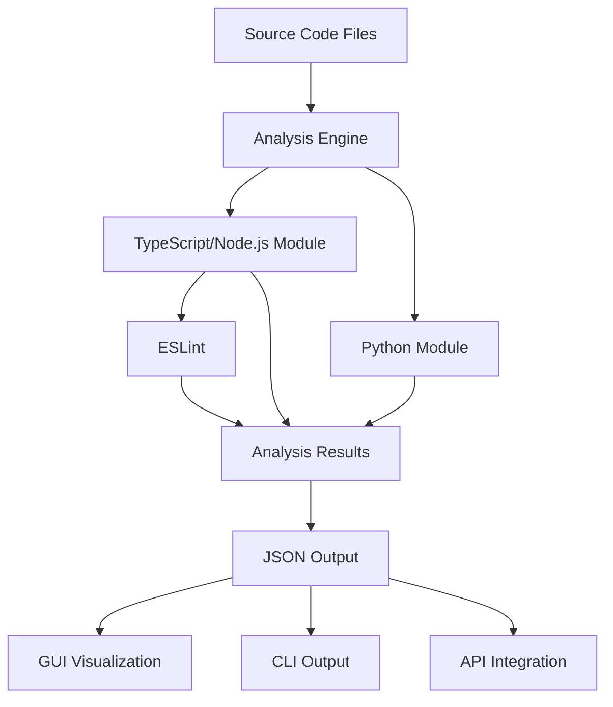
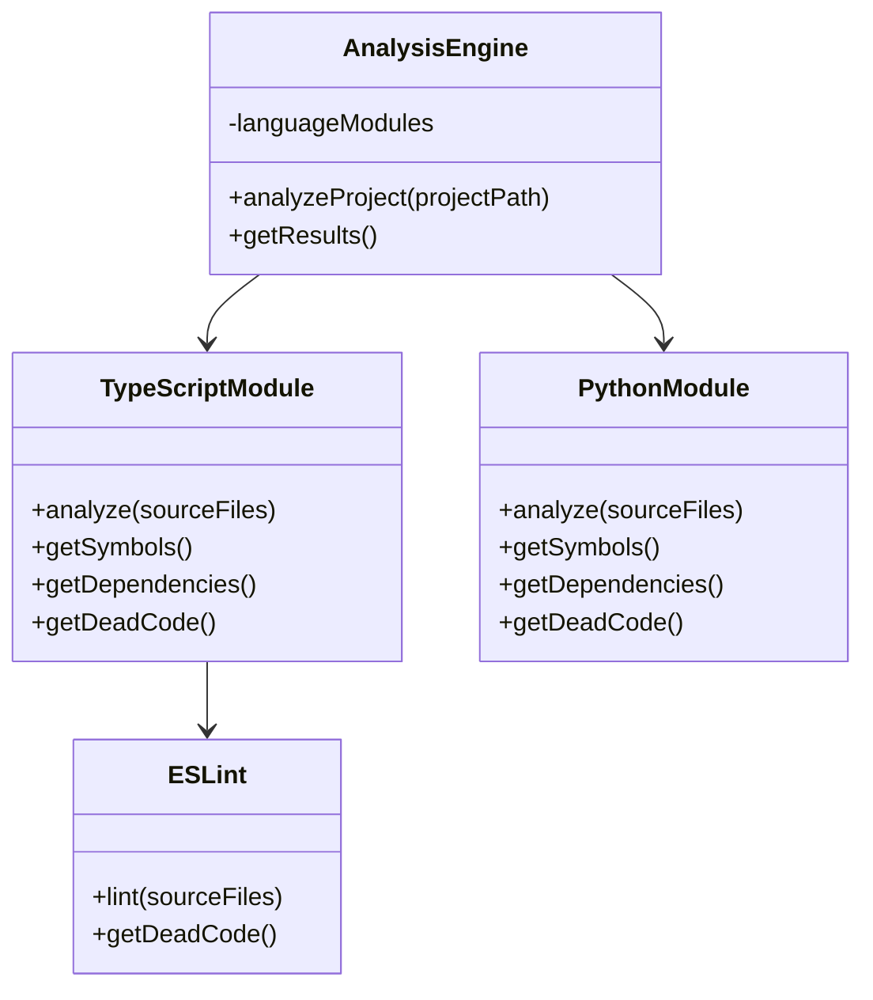

---
# Cytrac Software Design Description (SDD)

**Version:** 1.0
**Date:** September 18, 2025
**Authors:** CyrusTek Engineering Team
**Status:** Draft

---

## 1. Introduction
Cytrac is a comprehensive code analysis tool for TypeScript, JavaScript, Node.js, and Python. This Software Design Description (SDD) documents the detailed design, technology choices, interfaces, and rationale for the Cytrac system.

## 2. Design Overview
Cytrac is designed as a modular, extensible system with a clear separation between analysis engine, user interfaces (CLI and GUI), and language-specific modules. The design supports integration with external tools (e.g., Copilot), future language support, and interactive visualization of analysis results. The system leverages Node.js/TypeScript for the backend, ESLint and ts-morph for analysis, Python tools for Python support, and a graphical user interface for visualization and user interaction.

## 3. Architectural Design
Cytrac consists of the following major components:
- Analysis Engine: Core logic for code analysis and reporting
- Language Modules: TypeScript/Node.js and Python analyzers, pluggable for future language support
- CLI Interface: Command-line interface for running analysis
- GUI Interface: Graphical user interface for interactive analysis and visualization
- Integration API: REST endpoints for external tool integration

Component interactions are modular, with well-defined interfaces between engine, modules, and user interfaces. The architecture supports stateless analysis and easy extension.

## 4. Detailed Design
- Analysis Engine: Uses ts-morph and ESLint for TypeScript/Node.js analysis; integrates with Python tools (e.g., Jedi) for Python analysis. Processes source code, builds ASTs, and extracts symbols, dependencies, calls, types, references, and dead code.
- Language Modules: Each module implements a standard interface for analysis and reporting. Modules can be added or removed independently.
- CLI Interface: Provides commands for running analysis, specifying input projects, and outputting results in JSON format.
- GUI Interface: Allows users to run analysis, view results interactively, and explore code relationships. Communicates with backend via REST API.
- Integration API: Exposes endpoints for triggering analysis and retrieving results, enabling integration with Copilot or CI/CD systems.

## 5. Data Design
- Input: Source code files in supported languages (TypeScript, JavaScript, Node.js, Python)
- Output: Structured analysis results in JSON format, including symbols, dependencies, calls, types, references, and dead code
- Internal: AST representations, intermediate analysis data
- Visualization: Data structures for graphs, tables, and interactive UI elements

## 6. Interface Design
- CLI: Commands for running analysis, specifying input paths, and outputting results
- GUI: Actions for initiating analysis, viewing results, filtering, and exploring code relationships
- API: REST endpoints for triggering analysis and retrieving results; standardized request/response formats
- Language Module Interface: Standard interface for adding new analyzers

## 7. Component Design
- Analysis Engine: Main class/module orchestrating analysis, delegating to language modules
- TypeScript/Node.js Module: Implements analysis using ts-morph and ESLint
- Python Module: Implements analysis using Jedi and related tools
- CLI Module: Handles command-line parsing, user input, and output formatting
- GUI Module: Manages user interaction, visualization, and communication with backend
- API Module: Defines REST endpoints and handles external integration

## 8. Design Rationale
- Modular architecture enables maintainability, scalability, and future extensibility.
- API-driven design supports integration with external tools and automation workflows.
- Use of ts-morph and ESLint for TypeScript/Node.js leverages mature, well-supported analysis libraries.
- Python support via Jedi ensures multi-language capability.
- Separation of CLI and GUI interfaces provides flexibility for different user needs.
- JSON output and REST API facilitate interoperability and visualization.

## 9. Requirements Traceability
The following table maps major design elements to SRS requirements:

| SRS Requirement                | Design Element(s)                |
|--------------------------------|----------------------------------|
| Symbol analysis                | Analysis Engine, Language Modules|
| Dependency analysis            | Analysis Engine, Language Modules|
| Call graph analysis            | Analysis Engine, Language Modules|
| Type analysis                  | Analysis Engine, Language Modules|
| Reference analysis             | Analysis Engine, Language Modules|
| Dead code detection            | ESLint, Analysis Engine          |
| CLI interface                  | CLI Module                       |
| GUI interface                  | GUI Module                       |
| Visualization-ready output     | GUI Module, API Module           |
| Python support                 | Python Module                    |
| Extensibility                  | Modular architecture             |
| Integration API                | API Module                       |

## 10. Appendices

### Mermaid C4 Container Diagram
```mermaid
graph TD
    User[User]
### Mermaid UML Sequence Diagram: Analysis Flow
```mermaid
sequenceDiagram
    participant User
    participant CLI
    participant GUI
    participant Engine
    participant TSModule
    participant PyModule
    User->>CLI: Run analysis (CLI)
    User->>GUI: Run analysis (GUI)
    CLI->>Engine: analyzeProject(projectPath)
    GUI->>Engine: analyzeProject(projectPath)
    Engine->>TSModule: analyze(sourceFiles)
    Engine->>PyModule: analyze(sourceFiles)
    TSModule-->>Engine: analysis results
    PyModule-->>Engine: analysis results
    Engine->>CLI: getResults()
    Engine->>GUI: getResults()
```

### Mermaid UML Component Diagram
```mermaid
componentDiagram
    component AnalysisEngine
    component TypeScriptModule
    component PythonModule
    component ESLint
    component CLI
    component GUI
    component API
    AnalysisEngine --> TypeScriptModule
    AnalysisEngine --> PythonModule
    TypeScriptModule --> ESLint
    CLI --> AnalysisEngine
    GUI --> AnalysisEngine
    API --> AnalysisEngine
```

### Mermaid UML Deployment Diagram
```mermaid
deploymentDiagram
    node UserDevice {
        component CLI
        component GUI
    }
    node Server {
        component AnalysisEngine
        component TypeScriptModule
        component PythonModule
        component ESLint
        component API
    }
    UserDevice --> Server: REST/API Calls
```

### Mermaid Data Flow Diagram

    Engine[Analysis Engine]
    TSModule[TypeScript/Node.js Module]
    PyModule[Python Module]
    API[Integration API]
    Copilot[Copilot/External Tool]

    User -->|Runs analysis| CLI
    User -->|Runs analysis| GUI
    CLI -->|Invokes| Engine
    GUI -->|Invokes| Engine
    Engine -->|Uses| TSModule
    Engine -->|Uses| PyModule
    Engine -->|Exposes results| GUI
    Engine -->|Exposes results| CLI
    API -->|Triggers analysis| Engine
    Copilot -->|Uses| API
```

### Mermaid UML Class Diagram: Analysis Engine


- References
- Glossary
